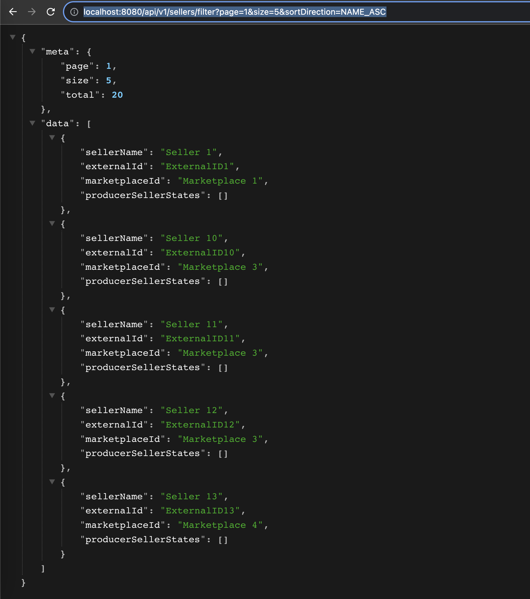
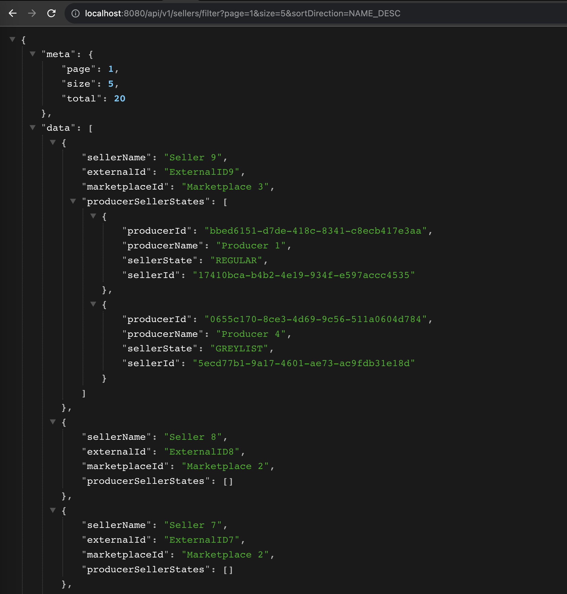
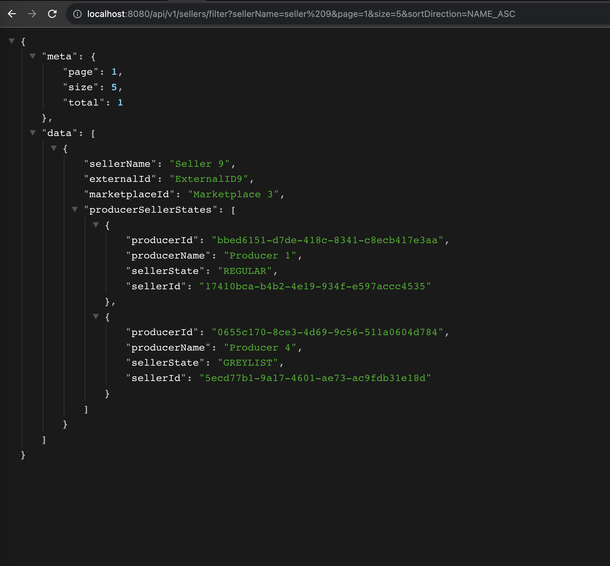
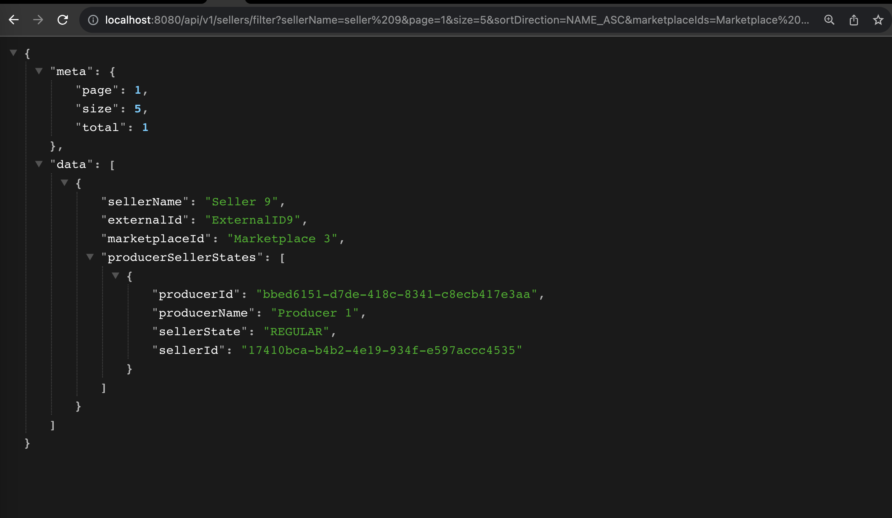

# SentrycInterview

Sample API endpoints:

http://localhost:8080/api/v1/sellers/filter?page=1&size=5&sortDirection=NAME_ASC

http://localhost:8080/api/v1/sellers/filter?page=1&size=5&sortDirection=NAME_DESC

http://localhost:8080/api/v1/sellers/filter?sellerName=seller%209&page=1&size=5&sortDirection=NAME_DESC

http://localhost:8080/api/v1/sellers/filter?sellerName=seller%209&page=1&size=5&sortDirection=NAME_DESC&producerIds=Producer%201
